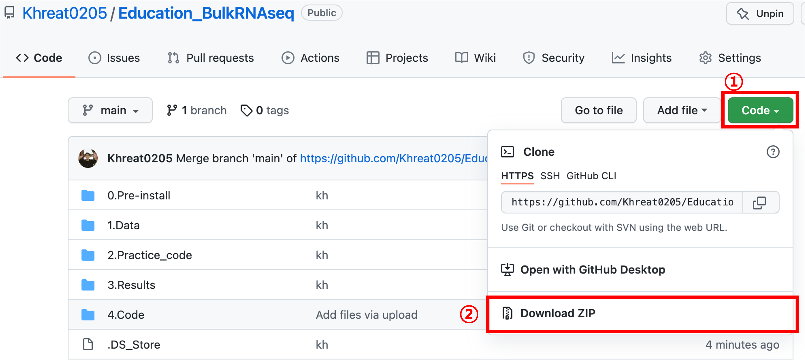

# Education_BulkRNAseq
### 교육 목표

GEO 플랫폼에서 RNA seq count 데이터를 획득, 이를 처리 및 활용하여 하위 분석(DEG 분석, GO 분석, 시각화)을 수행할 수 있다.

## I. 분석 예제 데이터

GEO series dataset: [GSE147035](https://www.ncbi.nlm.nih.gov/geo/query/acc.cgi?acc=GSE147035 ) 

논문: Primary germinal center-resident T follicular helper cells are a physiologically distinct subset of CXCR5hiPD-1hi T follicular helper cells. Yeh et al. *Immunity*. 2022. ([링크](https://www.sciencedirect.com/science/article/pii/S1074761321005513))

### 해당 GEO series 중 활용할 데이터

각 시기(Day 8,16,12,16,24) 별 동일한 mouse (3마리) 에서 채취한 두가지 세포 타입 sorting 후, RNA sequencing data

- GCTFH cell (12): Primary germinal center-resident T follicular helper cell ()
- TFH-like cell (12): T follicular helper like cell

## II. 분석 내용	

1. **GEO Data processing**
2. **Data Description**: PCA, Correlation analysis. (+ Quality check)
3. **Differentially Expressed Gene analysis**: DESeq2
4. **Visualization**: Volcano plot, Heatmap plot
5. **Gene Ontology analysis**: DAVID, Toppgene

## III. 실습 전 준비사항

1. 사전 다운로드
   1. 이 git을 압축파일로 다운로드 (아래그림 참조)
      1. 
2. 사전 설치 필요: 다운로드 받은 압축파일의 `0.Pre-install`에 위치한 파일 활용하여 설치
   1. R
   2. Rstudio
   3. R packages (DESeq2, BiocManager,data.table, biomaRt)

## IV. 진행 순서

1. 실습생 기본 환경 세팅 확인 
2. GEO 소개 및 다운로드, 처리 방법 (in R)
3. PCA 분석, 상관관계 그래프를 통한 데이터 확인 (in R)
4. DESeq2를 활용한 Differentially expressed genes 분석 (in R)
5. DEG 분석 시각화 (Volcano plot, Heatmap plot) (in R)
6. Gene ontology 및 관련 도구 소개, Gene ontology 분석 (in Web)
7. Q & A

## V. Contacts

서울대병원 의생명정보학 연구실 ([링크](https://sites.google.com/view/snuh-bmi-lab/home))

정경훈, scientist0205@snu.ac.kr 

이동주, ehdwn8242@snu.ac.kr 

양선아, tjsdk3105@gmail.com

